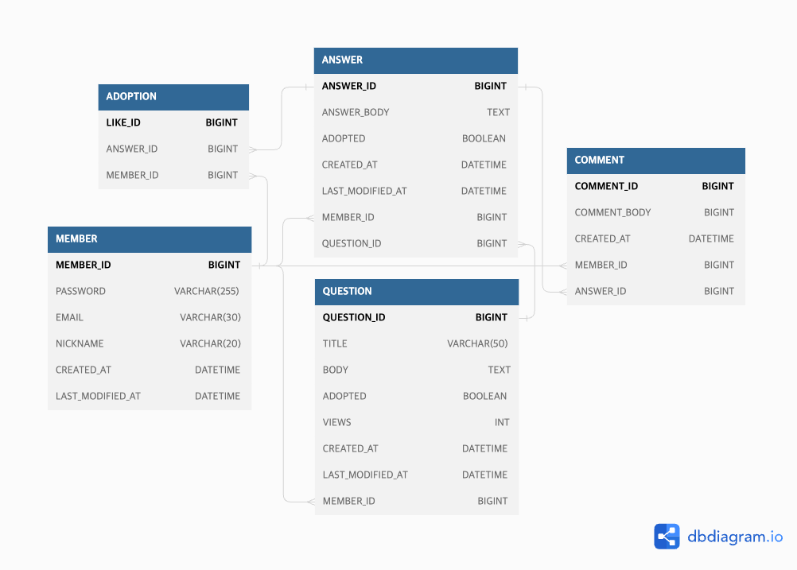

# 👨‍💻 프로젝트 개요

SynergyOverFlow는 게시판을 통해 회원이 등록한 질문을 다른 회원들이
답변과 댓글들을 작성하여 해결법을 제시해주는 웹 어플레케이션입니다.
 
 

## 🧑🏻‍💻 Member

<table>
<tbody>
    <tr>
        <td>
            
        </td>
        <td>
            
        </td>
        <td>
            
        </td>
        <td>
            
        </td>
        <td>
            
        </td>
        <td>
            
        </td>
    </tr>
    <tr>
        <td>
주동우 [팀장/FE]
</td>
        <td>
강예현 [FE]
</td>
        <td>
안현지 [FE]
</td>
        <td>
황호준 [부팀장/BE]
</td>
        <td>
신이수 [BE]
</td>
        <td>
이태섭 [BE]
</td>
    </tr>
</tbody>
</table>

[//]: # (
<h1>📚 STACKS AND TOOLS</h1>
)
 
 

# 📌 주요 기능

◽멤버십 
사용자는 닉네임, 이메일, 패스워드를 입력하여 회원 가입할 수 있고, 이미 가입된 이메일은 사용할 수 없습니다. 
이메일과 패스워드를 입력하여 로그인할 수 있으며, OAuth는 구글만 가능합니다. 
회원은 닉네임과 패스워드를 변경하거나 회원 정보를 삭제할 수 있습니다. 
 
◽질문리스트 
회원 여부와 상관없이 질문을 조회할 순 있지만, 게시글 작성은 회원만 가능합니다. 
게시글 작성 시 웹 에디터 라이브러리를 사용하여 다양한 서식을 적용할 수 있습니다. 
페이지네이션 기능을 통해 질문글 리스트 조회가 가능합니다. 
질문리스트에서 질문은 최신 순, 조회 순, 댓글 최신 순으로 정렬할 수 있습니다. 
 
◽답변 
회원만 답변 생성이 가능하고, 답변 등록 시 등록 날짜가 생성됩니다. 
답변은 사용자 정보와 함께 표시되며, 질문자는 답변 중 하나를 채택할 수 있습니다. 
답변은 수정, 조회, 삭제가 가능하며, 삭제 시 관련된 댓글도 함께 삭제됩니다. 

 
 

# 🗺️ ERD

 

# 📚 STACKS AND TOOLS

 

 

 

   
   
  
  
      
 

   

 

  

   

 
 

 

